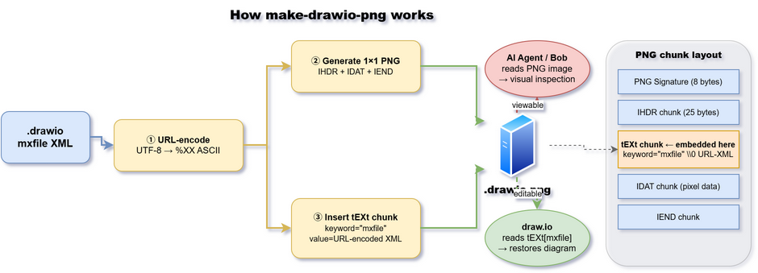

# Bob + draw.io CLI でドキュメントにきれいな図を埋め込む方法

このドキュメントでは、AI エージェント (Bob / Claude Code) が `.drawio` XML を自動生成し、
`make-drawio-png` と draw.io CLI を使って **視覚的にレンダリングされた、かつ再編集可能な PNG**
をドキュメントや README に埋め込むワークフローを説明します。

---

## なぜテキスト図では不十分なのか

| 手法 | 見た目 | 再編集 | AI生成 |
|---|---|---|---|
| Mermaid / PlantUML | △ シンプル | △ テキスト編集 | ✅ |
| ASCII アート | ✗ 粗い | ✗ | ✅ |
| `.drawio.png`（本手法） | ✅ 高品質 | ✅ draw.io アプリ | ✅ |

`.drawio.png` は PNG として表示しながら、draw.io アプリで開くと XML が復元されて再編集できます。

---

## セットアップ（1回だけ）

### 1. make-drawio-png をインストール

```bash
pip install make-drawio-png
```

> **Windows の注意:** `pip install` 後に `make-drawio-png` コマンドが使えない場合、
> Scripts ディレクトリが PATH に入っていない可能性があります。
> `python -m make_drawio_png` を使えば PATH 不要で動きます。

### 2. draw.io デスクトップをインストール

```bash
# Windows
winget install JGraph.Draw

# macOS
brew install --cask drawio

# Linux
snap install drawio
```

インストール後は自動検出されます。場所を明示したい場合は環境変数で指定できます：

```bash
# Windows
$env:DRAWIO_PATH = "C:\Users\you\AppData\Local\Programs\draw.io\draw.io.exe"

# macOS / Linux
export DRAWIO_PATH="/Applications/draw.io.app/Contents/MacOS/draw.io"
```

---

## ワークフロー全体像



```
① Bob が .drawio XML を生成
       ↓
② make-drawio-png --render で .drawio.png を生成
   （draw.io CLI でレンダリング → XML を tEXt チャンクに埋め込む）
       ↓
③ Markdown / README に画像として埋め込む
   
       ↓
④ draw.io アプリで再編集も可能
```

---

## Bob への指示の書き方

### 基本プロンプト

```
〇〇のシステム構成図を draw.io で作成してください。
- ファイルは docs/architecture.drawio として保存
- make-drawio-png --render で docs/architecture.drawio.png も生成
- README.md の「アーキテクチャ」セクションに画像を埋め込む
```

### Bob が内部で実行すること

1. `.drawio` XML を生成・保存
2. draw.io CLI でレンダリング + XML 埋め込み：
   ```bash
   python3 -m make_drawio_png --render docs/architecture.drawio
   ```
3. 生成した PNG を `read_file` で読み込んで内容確認
4. Markdown に `` を挿入

---

## 使い分けガイド

| シーン | コマンド / 関数 | draw.io 必要 |
|---|---|---|
| Bob が図を生成してすぐプレビュー | `python -m make_drawio_png --render file.drawio` | ✅ |
| draw.io なし環境・CI/CD | `python -m make_drawio_png file.drawio` | ❌ |
| Python から呼び出す（推奨） | `drawio_export("file.drawio")` | ✅ |
| Python から呼び出す（依存なし） | `drawio_to_png("file.drawio")` | ❌ |

```python
from make_drawio_png import drawio_export, drawio_to_png

# 推奨: レンダリング + 埋め込み（視覚的にきれい）
drawio_export("docs/architecture.drawio")
# → docs/architecture.drawio.png  (rendered + re-editable)

# 依存なし: 埋め込みのみ（draw.io アプリでは復元できる）
drawio_to_png("docs/architecture.drawio")
# → docs/architecture.drawio.png  (1x1 placeholder, re-editable)
```

---

## draw.io XML チートシート（Bob 向け）

Bob が `.drawio` ファイルを生成する際の最小テンプレートです。

### 基本構造

```xml
<mxfile host="app.diagrams.net">
  <diagram id="diagram-id" name="ページ名">
    <mxGraphModel>
      <root>
        <mxCell id="0"/>
        <mxCell id="1" parent="0"/>
        <!-- ここにノード・エッジを追加 -->
      </root>
    </mxGraphModel>
  </diagram>
</mxfile>
```

### よく使うノードスタイル

```xml
<!-- 角丸ボックス -->
<mxCell id="2" value="テキスト"
  style="rounded=1;whiteSpace=wrap;html=1;fillColor=#dae8fc;strokeColor=#6c8ebf;"
  vertex="1" parent="1">
  <mxGeometry x="100" y="100" width="160" height="60" as="geometry"/>
</mxCell>

<!-- スイムレーン -->
<mxCell id="3" value="レーン名"
  style="swimlane;startSize=30;fillColor=#f5f5f5;strokeColor=#666666;"
  vertex="1" parent="1">
  <mxGeometry x="40" y="40" width="400" height="300" as="geometry"/>
</mxCell>

<!-- 矢印 -->
<mxCell id="4" style="edgeStyle=orthogonalEdgeStyle;"
  edge="1" source="2" target="3" parent="1">
  <mxGeometry relative="1" as="geometry"/>
</mxCell>
```

---

## よくある問題

### draw.io が見つからない

```
DrawioCLINotFoundError: draw.io CLI not found.
Install it with: winget install JGraph.Draw
```

→ draw.io をインストールするか、`DRAWIO_PATH` 環境変数で場所を指定してください。

### Bob shell で `make-drawio-png` コマンドが動かない

Bob / Claude Code の shell は起動時の PATH を引き継ぎます。
Scripts ディレクトリが PATH にない場合は `python -m` を使います：

```bash
# NG（PATH に Scripts がない場合）
make-drawio-png --render file.drawio

# OK（常に動く）
python3 -m make_drawio_png --render file.drawio
```

### PNG が真っ黒・真っ白で中身が見えない

`--render` フラグを付け忘れています：

```bash
# NG（1×1 プレースホルダ）
python -m make_drawio_png file.drawio

# OK（draw.io CLI でレンダリング）
python -m make_drawio_png --render file.drawio
```

### 日本語が含まれる図が文字化けする

draw.io のフォント設定の問題です。Linux では以下を試してください：

```bash
# フォントのインストール（Ubuntu/Debian）
sudo apt-get install fonts-noto-cjk
```

---

## 関連リンク

- [make-drawio-png GitHub](https://github.com/phssakaigawa/make-drawio-png)
- [draw.io デスクトップ](https://github.com/jgraph/drawio-desktop/releases)
- [draw.io XML リファレンス](https://jgraph.github.io/mxgraph/docs/js-api/files/model/mxCell-js.html)
